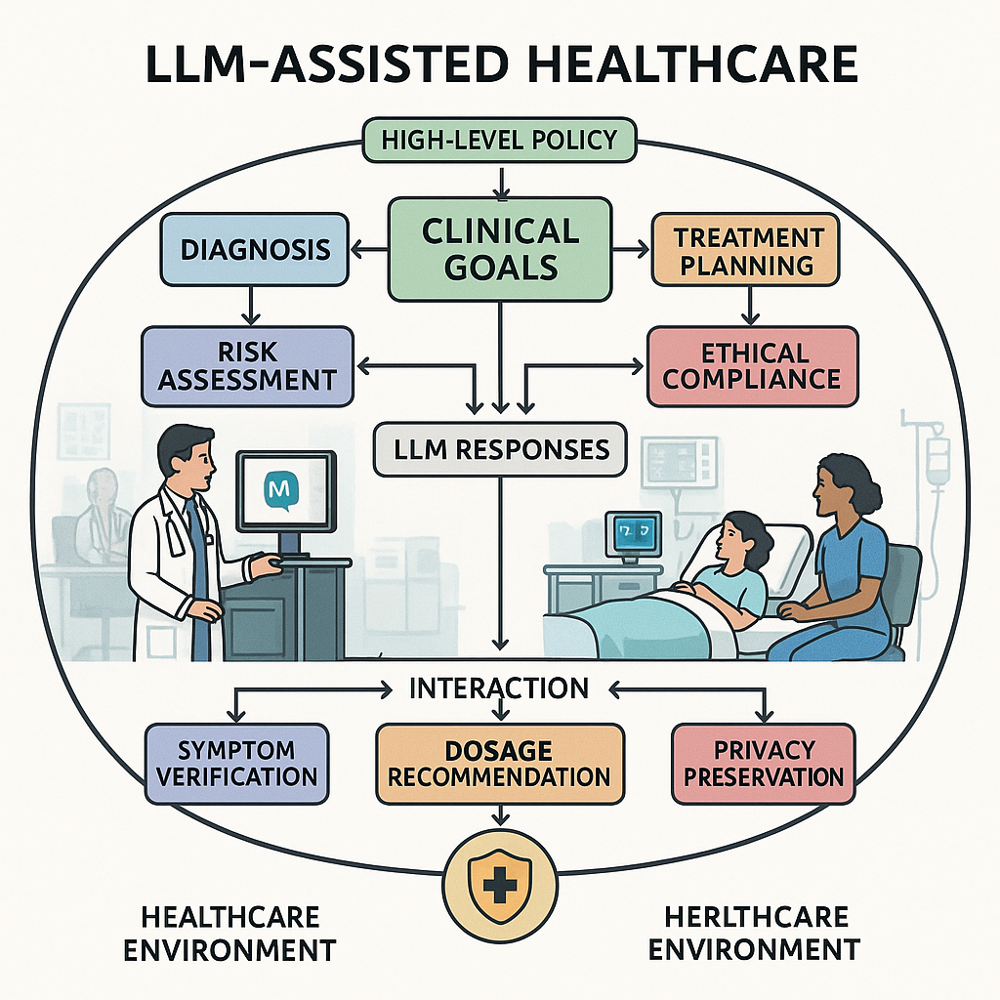
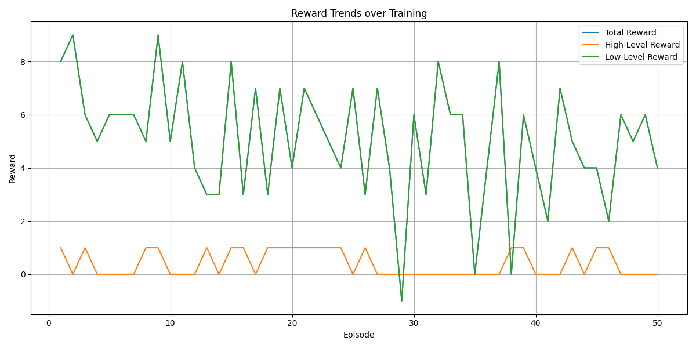
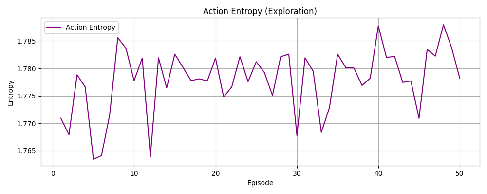

# HRLenv_2025
# Hierarchical Reinforcement Learning for Detecting Safety and Reliability Vulnerabilities in Large Language Model-Assisted Healthcare Systems

> IEEE Conference Publication | [Read on IEEE Xplore](https://ieeexplore.ieee.org/document/11427302)


---

## 📌 Overview

This repository contains the implementation for our IEEE-accepted paper on using **Hierarchical Reinforcement Learning (HRL)** to detect safety and reliability vulnerabilities in **Large Language Model (LLM)-assisted healthcare systems**.

As LLMs become integrated into clinical workflows, ensuring their robustness against failure modes is critical. This framework proactively identifies vulnerabilities using a hierarchical RL architecture trained on healthcare-relevant scenarios.



---

## 📁 Project Structure

```
├── main.py               # Entry point – runs training and evaluation
├── train.py              # HRL training loop
├── models.py             # HRL model definitions (high-level & low-level policies)
├── environment.py        # Custom healthcare LLM environment
├── plot_rewards.py        # Reward curve visualization
├── training_log.csv      # Training metrics log
├── reward_plot.png       # Reward convergence plot
├── entropy_plot.png      # Entropy plot over training
└── hrlenv/               # Virtual environment (not tracked)
```

---

## ⚙️ Setup Instructions

### Prerequisites

- Python 3.8+
- pip

### 1. Clone the Repository

```bash
git clone https://github.com/your-username/your-repo-name.git
cd your-repo-name
```

### 2. Create a Virtual Environment

```bash
python -m venv hrlenv
```

### 3. Activate the Environment

- **Windows:**
  ```bash
  hrlenv\Scripts\activate
  ```
- **macOS/Linux:**
  ```bash
  source hrlenv/bin/activate
  ```

### 4. Install Dependencies

```bash
pip install -r requirements.txt
```

> ⚠️ If `requirements.txt` is not present, install dependencies manually based on imports in `models.py` and `train.py`.

---

## 🚀 Usage

### Train the Model

```bash
python main.py
```

### Plot Training Rewards

```bash
python plot_rewards.py
```

Training metrics are saved to `training_log.csv` and plots are exported as PNG files.

---

## 📊 Results

Our HRL framework outperforms prior approaches on all metrics:

| Model | Accuracy (%) | Reward | Entropy |
|-------|-------------|--------|---------|
| **HRL (Ours)** | **92.5** | **2450** | **0.89** |
| Flat RL (REINFORCE) | 84.3 | 1930 | 0.72 |
| Rule-Based Filter | 79.1 | 1810 | 0.55 |

Reward and entropy convergence plots are available below:




---

## 📄 Citation

If you use this code, please cite our paper:

```bibtex
@inproceedings{Addobea2025hrl,
  title     = {Hierarchical Reinforcement Learning for Detecting Safety and Reliability Vulnerabilities in Large Language Model-Assisted Healthcare Systems},
  author    = {Your Name and Co-authors},
  booktitle = {Proceedings of the IEEE Conference},
  year      = {2025}
}
```

---

## 📬 Contact

For questions or collaborations, feel free to reach out via [LinkedIn](https://www.linkedin.com/in/madam-akosua-addobea08/) or open a GitHub issue.

---

*This work is published at IEEE. Please refer to the official publication for full details.*
